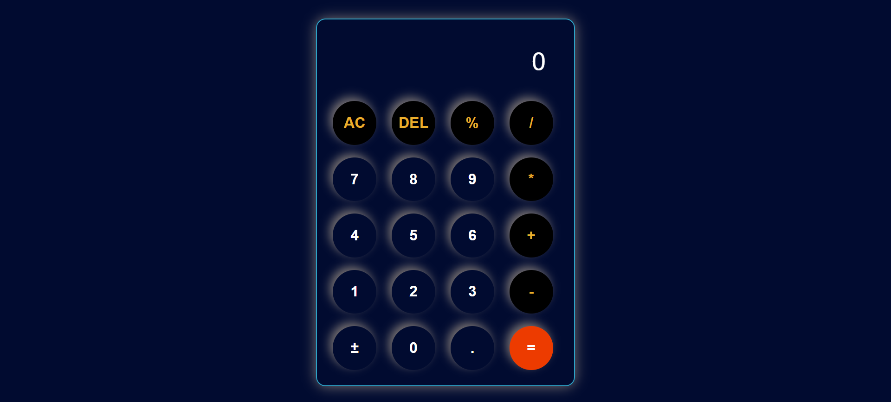

# Simple-Web-Calculator

A functional calculator built with **HTML, CSS, and JavaScript**.  
This project demonstrates basic DOM manipulation and event handling in JavaScript.

---

## 🚀 Features
- Perform basic arithmetic operations (Addition, Subtraction, Multiplication, Division)
- Clear and reset functionality
- Lightweight and simple

---

## 📂 Project Structure
```
Simple-Web-Calculator/
│── index.html   # Main HTML file
│── style.css    # CSS styling
│── script.js    # JavaScript logic
```

---

## 💻 How to Run
1. Clone the repository:
   ```bash
   git clone https://github.com/RabiaSiddique07/Simple-Web-Calculator.git
   ```
2. Open `index.html` in your browser.

---

## 🖼️ Demo
👉 [Live Demo](https://RabiaSiddique07.github.io/Simple-Web-Calculator/)  


---

## 📸 Screenshot
  


---

## 📜 License
This project is licensed under the **MIT License**.  
You are free to use, modify, and distribute this project for personal and commercial purposes.
